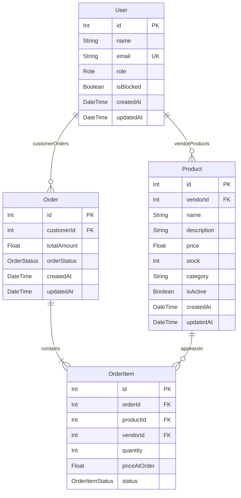

# ER Diagram

```mermaid
erDiagram
    User {
        Int id PK
        String name
        String email UK
        Role role
        Boolean isBlocked
        DateTime createdAt
        DateTime updatedAt
    }

    Product {
        Int id PK
        Int vendorId FK
        String name
        String description
        Float price
        Int stock
        String category
        Boolean isActive
        DateTime createdAt
        DateTime updatedAt
    }

    Order {
        Int id PK
        Int customerId FK
        Float totalAmount
        OrderStatus orderStatus
        DateTime createdAt
        DateTime updatedAt
    }

    OrderItem {
        Int id PK
        Int orderId FK
        Int productId FK
        Int vendorId FK
        Int quantity
        Float priceAtOrder
        OrderItemStatus status
    }

    User ||--o{ Product : "vendorProducts"
    User ||--o{ Order : "customerOrders"
    Order ||--|{ OrderItem : "contains"
    Product ||--o{ OrderItem : "appearsIn"
```
