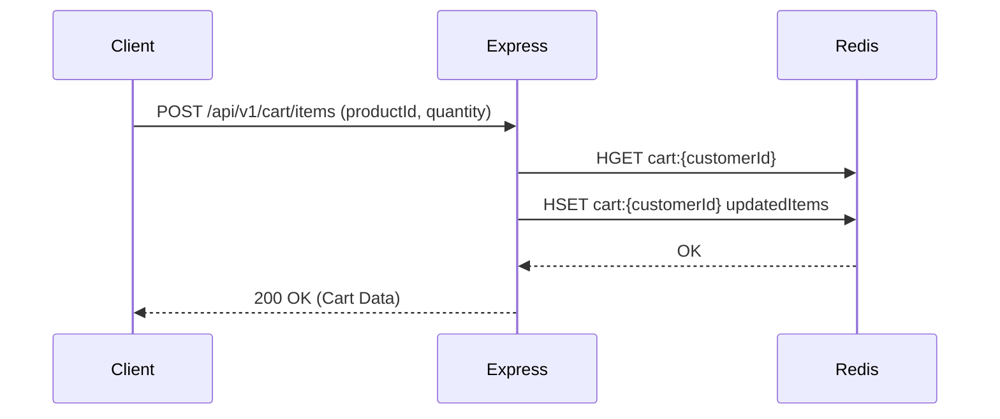
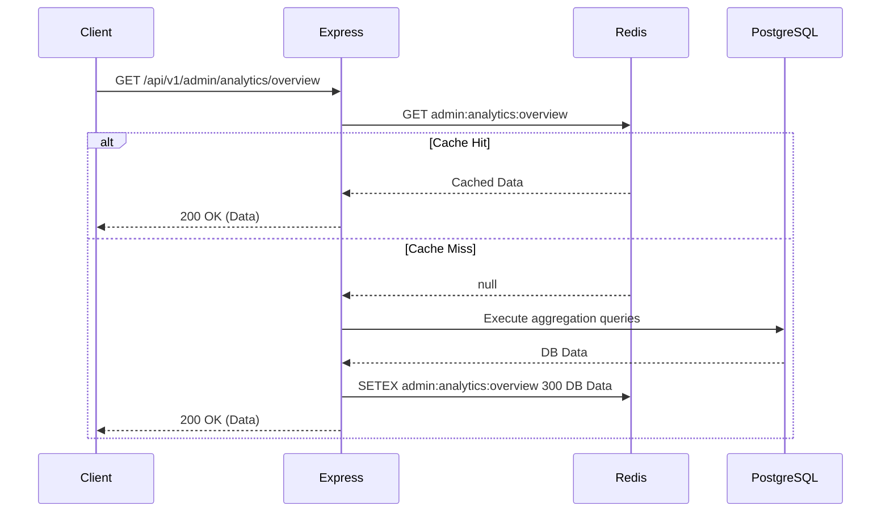

# Request Flows

## Cart Flow

```mermaid
sequenceDiagram
    participant Client
    participant Express
    participant Redis

    Client->>Express: POST /api/v1/cart/items (productId, quantity)
    Express->>Redis: HGET cart:{customerId}
    Express->>Redis: HSET cart:{customerId} updatedItems
    Redis-->>Express: OK
    Express-->>Client: 200 OK (Cart Data)
```

## Analytics Flow

```mermaid
sequenceDiagram
    participant Client
    participant Express
    participant Redis
    participant PostgreSQL

    Client->>Express: GET /api/v1/admin/analytics/overview
    Express->>Redis: GET admin:analytics:overview
    alt Cache Hit
        Redis-->>Express: Cached Data
        Express-->>Client: 200 OK (Data)
    else Cache Miss
        Redis-->>Express: null
        Express->>PostgreSQL: Execute aggregation queries
        PostgreSQL-->>Express: DB Data
        Express->>Redis: SETEX admin:analytics:overview 300 DB Data
        Express-->>Client: 200 OK (Data)
    end
```
