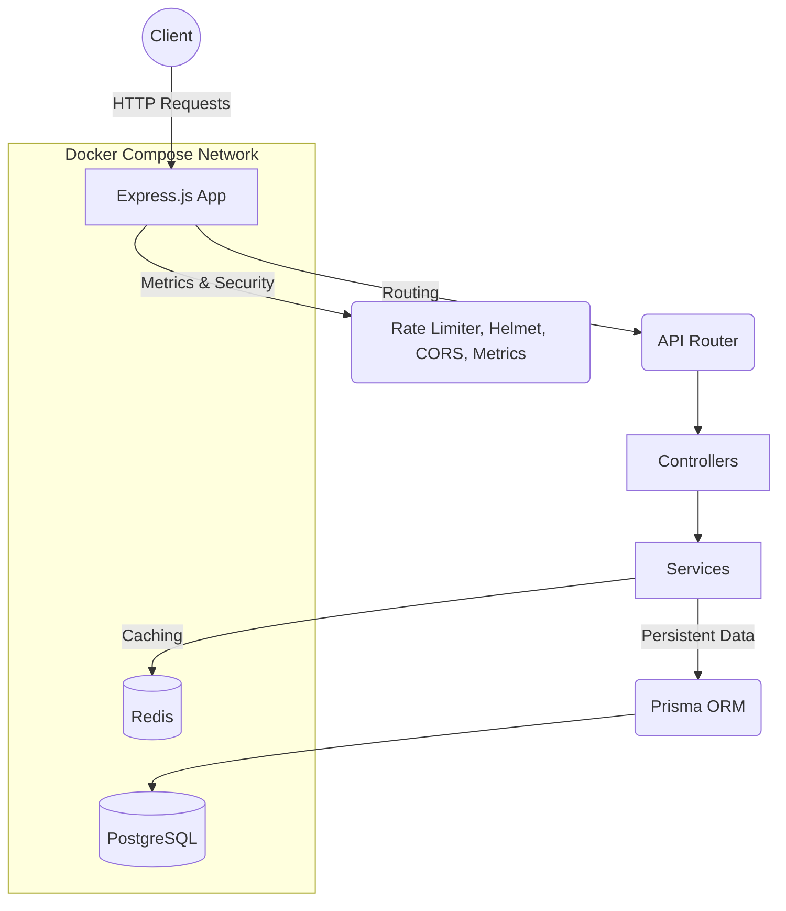

# System Design Diagram

```mermaid
graph TD
    Client((Client)) --> |HTTP Requests| Express[Express.js App]
    Express --> |Metrics & Security| Middleware(Rate Limiter, Helmet, CORS, Metrics)
    Express --> |Routing| Router(API Router)
    Router --> Controller[Controllers]
    Controller --> Service[Services]
    
    Service --> |Caching| Redis[(Redis)]
    Service --> |Persistent Data| Prisma(Prisma ORM)
    Prisma --> Postgres[(PostgreSQL)]
    
    subgraph "Docker Compose Network"
        Express
        Redis
        Postgres
    end
```
